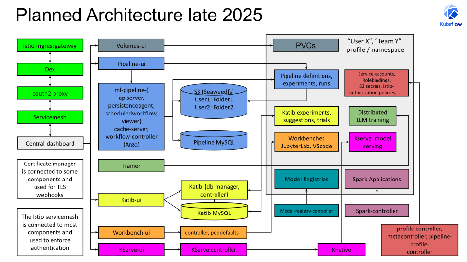

# Kubeflow Manifests


[](https://www.bestpractices.dev/projects/9940)

The **Kubeflow Manifests** are a collection of community-maintained manifests for installing Kubeflow in popular Kubernetes clusters such as Kind, Minikube, Rancher, EKS, AKS, and GKE. The manifests include all Kubeflow components (Pipelines, Kserve, etc.), the **Kubeflow Central Dashboard**, and other applications that comprise the **Kubeflow Platform**. This installation is beneficial for users wanting to explore the end-to-end capabilities of the Kubeflow Platform.

For a stable and conservative experience, we recommend using the [latest stable release](https://github.com/kubeflow/manifests/releases). However, please consult the more up-to-date documentation in the master branch.
You can also install the master branch of [`kubeflow/manifests`](https://github.com/kubeflow/manifests) by following the instructions [here](https://github.com/kubeflow/manifests?tab=readme-ov-file#installation) and providing us with feedback.

We are planning to cut 2 releases per year, for example 26.03 and 26.10 before each KubeCon EU and NA.
We ask each working group/component to provide non-breaking patch releases for 6 months based on the version in each date release.
We try to BEST-EFFORT support each realease for 6 monhts as community. There is [commercial support](https://www.kubeflow.org/docs/started/support/#support-from-commercial-providers-in-the-kubeflow-ecosystem) available if needed.
The working groups (KFP, Katib, Trainer, ...) are allowed to release new component versions with breaking changes, but they will only be included in the master branch or the next date release.
This should only apply to “stable” components, as “alpha/beta” components might release breaking changes in patch releases.

## Table of Contents

<!-- toc -->

- [Overview of the Kubeflow Platform](#overview-of-the-kubeflow-platform)
- [Kubeflow Components Versions](#kubeflow-components-versions)
- [Installation](#installation)
  - [Prerequisites](#prerequisites)
  - [Install with a Single Command](#install-with-a-single-command)
  - [Install Individual Components](#install-individual-components)
  - [Connect to Your Kubeflow Cluster](#connect-to-your-kubeflow-cluster)
  - [Change Default User Name](#change-default-user-name)
  - [Change Default User Password](#change-default-user-password)
- [Upgrading and Extending](#upgrading-and-extending)
- [Release Process](#release-process)
- [Security](#security)
- [Pre-commit Hooks](#pre-commit-hooks)
- [Architecture](#architecture)
- [Frequently Asked Questions](#frequently-asked-questions)

<!-- tocstop -->

## Overview of the Kubeflow Platform

- This repository is owned by the [Platform/Manifests/security Working Group](https://github.com/kubeflow/community/blob/master/wg-manifests/charter.md).
- You can join the CNCF Slack and access our meetings at the [Kubeflow Community](https://www.kubeflow.org/docs/about/community/) website.
- Our channel on the CNCF Slack is [**#kubeflow-platform**](https://app.slack.com/client/T08PSQ7BQ/C073W572LA2).
- You can also find our [biweekly meetings](https://bit.ly/kf-wg-manifests-meet), including the commentable [Agenda](https://bit.ly/kf-wg-manifests-notes).
- If you want to contribute, please take a look at the [CONTRIBUTING.md](CONTRIBUTING.md).

The Kubeflow Manifests repository is organized under three main directories, which include manifests for installing:

| Directory | Purpose |
| - | - |
| `applications` | Kubeflow's official components, maintained by the respective Kubeflow WGs |
| `common` | Common services, maintained by the Manifests WG |
| `experimental` | Third-party integrations and platform experiments (e.g., Ray, SeaweedFS, or security improvements) |

All components are deployable with `kustomize`. You can choose to deploy the entire Kubeflow platform or individual components.

## Kubeflow Components Versions

### Kubeflow Version: Master

This repository periodically synchronizes all official Kubeflow components from the respective upstream repositories. The following matrix shows the git version included for each component along with the resource requirements for each Kubeflow component, calculated as the maximum of actual usage and configured requests for CPU/memory as well as storage requirements from PVCs:

| Component | Local Manifests Path | Upstream Revision | CPU (millicores) | Memory (Mi) |  PVC Storage (GB) |
| - | - | - | - | - | - |
| Training Operator | applications/training-operator/upstream | [v1.9.2](https://github.com/kubeflow/training-operator/tree/v1.9.2/manifests) | 3m | 25Mi | 0GB |
| Trainer | applications/trainer/upstream | [v2.1.0](https://github.com/kubeflow/trainer/tree/v2.1.0/manifests) | 8m | 143Mi | 0GB |
| Notebook Controller | applications/jupyter/notebook-controller/upstream | [v1.10.0](https://github.com/kubeflow/kubeflow/tree/v1.10.0/components/notebook-controller/config) | 5m | 93Mi | 0GB |
| PVC Viewer Controller | applications/pvcviewer-controller/upstream | [v1.10.0](https://github.com/kubeflow/kubeflow/tree/v1.10.0/components/pvcviewer-controller/config) | 15m | 128Mi | 0GB |
| Tensorboard Controller | applications/tensorboard/tensorboard-controller/upstream | [v1.10.0](https://github.com/kubeflow/kubeflow/tree/v1.10.0/components/tensorboard-controller/config) | 15m | 128Mi | 0GB |
| Central Dashboard | applications/centraldashboard/upstream | [v1.10.0](https://github.com/kubeflow/kubeflow/tree/v1.10.0/components/centraldashboard/manifests) | 2m | 159Mi | 0GB |
| Profiles + KFAM | applications/profiles/upstream | [v1.10.0](https://github.com/kubeflow/kubeflow/tree/v1.10.0/components/profile-controller/config) | 7m | 129Mi | 0GB |
| PodDefaults Webhook | applications/admission-webhook/upstream | [v1.10.0](https://github.com/kubeflow/kubeflow/tree/v1.10.0/components/admission-webhook/manifests) | 1m | 14Mi | 0GB |
| Jupyter Web Application | applications/jupyter/jupyter-web-app/upstream | [v1.10.0](https://github.com/kubeflow/kubeflow/tree/v1.10.0/components/crud-web-apps/jupyter/manifests) | 4m | 231Mi | 0GB |
| Tensorboards Web Application | applications/tensorboard/tensorboards-web-app/upstream | [v1.10.0](https://github.com/kubeflow/kubeflow/tree/v1.10.0/components/crud-web-apps/tensorboards/manifests) |  |  |  |
| Volumes Web Application | applications/volumes-web-app/upstream | [v1.10.0](https://github.com/kubeflow/kubeflow/tree/v1.10.0/components/crud-web-apps/volumes/manifests) | 4m | 226Mi | 0GB |
| Katib | applications/katib/upstream | [v0.19.0](https://github.com/kubeflow/katib/tree/v0.19.0/manifests/v1beta1) | 13m | 476Mi | 10GB |
| KServe | applications/kserve/kserve | [v0.15.2](https://github.com/kserve/kserve/releases/tag/v0.15.2/install/v0.15.2) | 600m | 1200Mi | 0GB |
| KServe Models Web Application | applications/kserve/models-web-app | [v0.15.0](https://github.com/kserve/models-web-app/tree/v0.15.0/config) | 6m | 259Mi  | 0GB |
| Kubeflow Pipelines | applications/pipeline/upstream | [2.15.0](https://github.com/kubeflow/pipelines/tree/2.15.0/manifests/kustomize) | 970m | 3552Mi | 35GB |
| Kubeflow Model Registry | applications/model-registry/upstream | [v0.3.4](https://github.com/kubeflow/model-registry/tree/v0.3.4/manifests/kustomize) | 510m | 2112Mi | 20GB |
| Spark Operator	|	applications/spark/spark-operator	|	[2.4.0](https://github.com/kubeflow/spark-operator/tree/v2.4.0) | 9m | 41Mi | 0GB |
| Istio | common/istio | [1.28.0](https://github.com/istio/istio/releases/tag/1.28.0) | 750m | 2364Mi | 0GB |
| Knative | common/knative/knative-serving <br /> common/knative/knative-eventing | [v1.20.0](https://github.com/knative/serving/releases/tag/knative-v1.20.0) <br /> [v1.20.0](https://github.com/knative/eventing/releases/tag/knative-v1.20.0) | 1450m | 1038Mi | 0GB |
| Cert Manager | common/cert-manager | [1.16.1](https://github.com/cert-manager/cert-manager/releases/tag/v1.16.1) | 3m | 128Mi | 0GB |
| Dex | common/dex | [2.43.1](https://github.com/dexidp/dex/releases/tag/v2.43.1) | 3m | 27Mi | 0GB |
| OAuth2-Proxy | common/oauth2-proxy | [7.10.0](https://github.com/oauth2-proxy/oauth2-proxy/releases/tag/v7.10.0) | 3m | 27Mi | 0GB |
| **Total** | | | **4380m** | **12341Mi** | **65GB** |


## Installation

This section covers the installation from scratch. For the in-place upgrade guide, please jump to the [Upgrading and Extending](#upgrading-and-extending) section.

Although our master branch has extended automated tests and is already quite stable, please consider using a stable [release tag/branch](https://github.com/kubeflow/manifests/releases) for a more conservative experience.

We provide two options for installing the official Kubeflow components and common services with Kustomize. The aim is to help users install easily and building distributions of Kubeflow by deriving / deviating from the Kubeflow manifests:

1. Single-command installation of all components under `applications` and `common`
2. Multi-command, individual component installation for `applications` and `common`

Option 1 targets ease of deployment for end users. \
Option 2 targets customization, allowing users to pick and choose individual components.

The `example` directory contains an example kustomization for the single command to be able to run.

:warning: In both options, we use a default email (`user@example.com`) and password (`12341234`). For any production Kubeflow deployment, you should change the default password by following [the relevant section](#change-default-user-password).

### Prerequisites
- This is the master branch, which targets Kubernetes version 1.34+.
- For the specific Kubernetes version per release, consult the [release notes](https://github.com/kubeflow/manifests/releases).
- Either our local Kind (installed below) or your own Kubernetes cluster with a default [StorageClass](https://kubernetes.io/docs/concepts/storage/storage-classes/).
- Kustomize version [5.7.1](https://github.com/kubernetes-sigs/kustomize/releases/tag/kustomize%2Fv5.7.1).
- Kubectl version compatible with your Kubernetes cluster ([Version Skew Policy](https://kubernetes.io/releases/version-skew-policy/#kubectl)).

---
**NOTE**

`kubectl apply` commands may fail on the first try. This is inherent in how Kubernetes and `kubectl` work (e.g., CR must be created after CRD becomes ready). The solution is to simply re-run the command until it succeeds. For the single-line command, we have included a bash one-liner to retry the command.

---

### Install with a Single Command

#### Prerequisites
- 16 GB of RAM recommended.
- 8 CPU cores recommended.
- `kind` version 0.27+.
- `docker` or a more modern tool such as `podman` to run the OCI images for the Kind cluster.
- Linux kernel subsystem changes to support many pods:
    - `sudo sysctl fs.inotify.max_user_instances=2280`
    - `sudo sysctl fs.inotify.max_user_watches=1255360`
- You can exclude components from the `example/kustomization.yaml` to fit Kubeflow into 4-8 GB of memory and 2-4 CPU cores.

#### Create Kind Cluster
```sh
cat <<EOF | kind create cluster --name=kubeflow --config=-
kind: Cluster
apiVersion: kind.x-k8s.io/v1alpha4
nodes:
- role: control-plane
  image: kindest/node:v1.34.0@sha256:7416a61b42b1662ca6ca89f02028ac133a309a2a30ba309614e8ec94d976dc5a
  kubeadmConfigPatches:
  - |
    kind: ClusterConfiguration
    apiServer:
      extraArgs:
        "service-account-issuer": "https://kubernetes.default.svc"
        "service-account-signing-key-file": "/etc/kubernetes/pki/sa.key"
EOF
```

#### Save Kubeconfig
```sh
kind get kubeconfig --name kubeflow > /tmp/kubeflow-config
export KUBECONFIG=/tmp/kubeflow-config
```

#### Create a Secret Based on Existing Credentials to Pull the Images
```sh
docker login

kubectl create secret generic regcred \
    --from-file=.dockerconfigjson=$HOME/.docker/config.json \
    --type=kubernetes.io/dockerconfigjson
```

You can install all Kubeflow official components (residing under `applications`) and all common services (residing under `common`) using the following command:

```sh
while ! kustomize build example | kubectl apply --server-side --force-conflicts -f -; do echo "Retrying to apply resources"; sleep 20; done
```

Once everything is installed successfully, you can access the Kubeflow Central Dashboard [by logging in to your cluster](#connect-to-your-kubeflow-cluster).

Congratulations! You can now start experimenting and running your end-to-end ML workflows with Kubeflow.

### Install Individual Components

In this section, we will install each Kubeflow official component (under `applications`) and each common service (under `common`) separately, using just `kubectl` and `kustomize`.

If all the following commands are executed, the result is the same as in the above section of the single command installation. The purpose of this section is to:

- Provide a description of each component and insight on how it gets installed.
- Enable the user or distribution owner to pick and choose only the components they need.

---
**Troubleshooting Note**

We have seen errors like the following when applying the kustomizations of different components:
```
error: resource mapping not found for name: "<RESOURCE_NAME>" namespace: "<SOME_NAMESPACE>" from "STDIN": no matches for kind "<CRD_NAME>" in version "<CRD_FULL_NAME>"
ensure CRDs are installed first
```

This is because a kustomization applies both a CRD and a CR very quickly, and the CRD has not yet become [`Established`](https://github.com/kubernetes/apiextensions-apiserver/blob/a7ee7f91a2d0805f729998b85680a20cfba208d2/pkg/apis/apiextensions/types.go#L276-L279) yet. You can learn more about this in <https://github.com/kubernetes/kubectl/issues/1117> and <https://github.com/helm/helm/issues/4925>.

If you encounter this error, we advise re-applying the manifests of the component.

---


#### Kubeflow Namespace

Create the namespaces where the Kubeflow components will reside. We are in the transition from `kubeflow` to `kubeflow-system`.

Install the Kubeflow namespace:

```sh
kustomize build common/kubeflow-namespace/base | kubectl apply -f -
```

#### Cert-manager

Cert-manager is used by many Kubeflow components to provide certificates for admission webhooks.

Install cert-manager:

```sh
kustomize build common/cert-manager/base | kubectl apply -f -
kustomize build common/cert-manager/kubeflow-issuer/base | kubectl apply -f -
echo "Waiting for cert-manager to be ready ..."
kubectl wait --for=condition=Ready pod -l 'app in (cert-manager,webhook)' --timeout=180s -n cert-manager
kubectl wait --for=jsonpath='{.subsets[0].addresses[0].targetRef.kind}'=Pod endpoints -l 'app in (cert-manager,webhook)' --timeout=180s -n cert-manager
```

In case you encounter this error:
```
Error from server (InternalError): error when creating "STDIN": Internal error occurred: failed calling webhook "webhook.cert-manager.io": failed to call webhook: Post "https://cert-manager-webhook.cert-manager.svc:443/mutate?timeout=10s": dial tcp 10.96.202.64:443: connect: connection refused
```
This is because the webhook is not yet ready to receive requests. Wait a couple of seconds and retry applying the manifests.

For more troubleshooting info, also check out <https://cert-manager.io/docs/troubleshooting/webhook/>.

#### Istio

Istio is used by most Kubeflow components to secure their traffic, enforce network authorization, and implement routing policies. This installation uses Istio CNI, which eliminates the need for privileged init containers and improves compatibility with Pod Security Standards. If you use Cilium CNI on your cluster, you must configure it properly for Istio as shown [here](https://docs.cilium.io/en/latest/network/servicemesh/istio/); otherwise, you will encounter RBAC access denied on the central dashboard.

Install Istio:

```sh
echo "Installing Istio CNI configured with external authorization..."
kustomize build common/istio/istio-crds/base | kubectl apply -f -
kustomize build common/istio/istio-namespace/base | kubectl apply -f -

# For most platforms (Kind, Minikube, AKS, EKS, etc.)
kustomize build common/istio/istio-install/overlays/oauth2-proxy | kubectl apply -f -

# For Google Kubernetes Engine (GKE), use:
# kustomize build common/istio/istio-install/overlays/gke | kubectl apply -f -

echo "Waiting for all Istio Pods to become ready..."
kubectl wait --for=condition=Ready pods --all -n istio-system --timeout 300s
```

#### Oauth2-proxy

The oauth2-proxy extends your Istio Ingress-Gateway capabilities to function as an OIDC client. It supports user sessions as well as proper token-based machine-to-machine authentication.

```sh
echo "Installing oauth2-proxy..."

# Only uncomment ONE of the following overlays, as they are mutually exclusive.
# See `common/oauth2-proxy/overlays/` for more options.

# OPTION 1: works on most clusters, does NOT allow K8s service account
#           tokens to be used from outside the cluster via the Istio ingress-gateway.
#
kustomize build common/oauth2-proxy/overlays/m2m-dex-only/ | kubectl apply -f -
kubectl wait --for=condition=Ready pod -l 'app.kubernetes.io/name=oauth2-proxy' --timeout=180s -n oauth2-proxy

# Option 2: works on Kind, K3D, Rancher, GKE, and many other clusters with the proper configuration, and allows K8s service account tokens to be used
#           from outside the cluster via the Istio ingress-gateway. For example, for automation with GitHub Actions.
#           In the end, you need to patch the issuer and jwksUri fields in the request authentication resource in the istio-system namespace
#           as done in /common/oauth2-proxy/overlays/m2m-dex-and-kind/kustomization.yaml.
#           Please follow the guidelines in the section Upgrading and Extending below for patching.
#           curl --insecure -H "Authorization: Bearer `cat /var/run/secrets/kubernetes.io/serviceaccount/token`"  https://kubernetes.default/.well-known/openid-configuration
#           from a pod in the cluster should provide you with the issuer of your cluster.
#
#kustomize build common/oauth2-proxy/overlays/m2m-dex-and-kind/ | kubectl apply -f -
#kubectl wait --for=condition=Ready pod -l 'app.kubernetes.io/name=oauth2-proxy' --timeout=180s -n oauth2-proxy
#kubectl wait --for=condition=Ready pod -l 'app.kubernetes.io/name=cluster-jwks-proxy' --timeout=180s -n istio-system

# OPTION 3: works on most EKS clusters with K8s service account
#           tokens to be used from outside the cluster via the Istio ingress-gateway.
#           You have to adjust AWS_REGION and CLUSTER_ID in common/oauth2-proxy/overlays/m2m-dex-and-eks/ first.
#
#kustomize build common/oauth2-proxy/overlays/m2m-dex-and-eks/ | kubectl apply -f -
#kubectl wait --for=condition=Ready pod -l 'app.kubernetes.io/name=oauth2-proxy' --timeout=180s -n oauth2-proxy
```

If and after you finish the installation with Kubernetes service account token support, you should be able to create and use the tokens:
```sh
kubectl port-forward svc/istio-ingressgateway -n istio-system 8080:80
TOKEN="$(kubectl -n $KF_PROFILE_NAMESPACE create token default-editor)"
client = kfp.Client(host="http://localhost:8080/pipeline", existing_token=token)
curl -v "localhost:8080/jupyter/api/namespaces/${$KF_PROFILE_NAMESPACE}/notebooks" -H "Authorization: Bearer ${TOKEN}"
```

If you want to use OAuth2 Proxy without Dex and connect it directly to your own IDP, you can refer to this [document](common/oauth2-proxy/README.md#change-default-authentication-from-dex--oauth2-proxy-to-oauth2-proxy-only). However, you can also keep Dex and extend it with connectors to your own IDP as explained in the Dex section below.

#### Dex

Dex is an OpenID Connect (OIDC) identity provider with multiple authentication backends. In this default installation, it includes a static user with the email `user@example.com`. By default, the user's password is `12341234`. For any production Kubeflow deployment, you should change the default password by following [the relevant section](#change-default-user-password).

Install Dex:

```sh
echo "Installing Dex..."
kustomize build common/dex/overlays/oauth2-proxy | kubectl apply -f -
kubectl wait --for=condition=Ready pods --all --timeout=180s -n auth
```

To connect to your desired identity providers (LDAP, GitHub, Google, Microsoft, OIDC, SAML, GitLab), please take a look at <https://dexidp.io/docs/connectors/oidc/>. We recommend using OIDC in general since it is compatible with most providers. For example, Azure in the following example. You need to modify <https://github.com/kubeflow/manifests/blob/master/common/dex/overlays/oauth2-proxy/config-map.yaml> and add some environment variables in <https://github.com/kubeflow/manifests/blob/master/common/dex/base/deployment.yaml> by adding a patch section in your main Kustomization file. For guidance, please check out [Upgrading and Extending](#upgrading-and-extending).

```yaml
apiVersion: v1
kind: ConfigMap
metadata:
  name: dex
data:
  config.yaml: |
    issuer: https://$KUBEFLOW_INGRESS_URL/dex
    storage:
      type: kubernetes
      config:
        inCluster: true
    web:
      http: 0.0.0.0:5556
    logger:
      level: "debug"
      format: text
    oauth2:
      skipApprovalScreen: true
    enablePasswordDB: true
    #### WARNING: YOU SHOULD NOT USE THE DEFAULT STATIC PASSWORDS
    #### and patch /common/dex/base/dex-passwords.yaml in a Kustomize overlay or remove it
    staticPasswords:
    - email: user@example.com
      hashFromEnv: DEX_USER_PASSWORD
      username: user
      userID: "15841185641784"
    staticClients:
    # https://github.com/dexidp/dex/pull/1664
    - idEnv: OIDC_CLIENT_ID
      redirectURIs: ["/oauth2/callback"]
      name: 'Dex Login Application'
      secretEnv: OIDC_CLIENT_SECRET
    #### Here come the connectors to OIDC providers such as Azure, GCP, GitHub, GitLab, etc.
    #### Connector config values starting with a "$" will read from the environment.
    connectors:
    - type: oidc
      id: azure
      name: azure
      config:
        issuer: https://login.microsoftonline.com/$TENANT_ID/v2.0
        redirectURI: https://$KUBEFLOW_INGRESS_URL/dex/callback
        clientID: $AZURE_CLIENT_ID
        clientSecret: $AZURE_CLIENT_SECRET
        insecureSkipEmailVerified: true
        scopes:
        - openid
        - profile
        - email
        #- groups # groups might be used in the future
```

For Keycloak, we have rough guidelines in <https://github.com/kubeflow/manifests/blob/master/common/dex/README.md>.

#### Knative

Knative is used by the KServe official Kubeflow component.

Install Knative Serving:

```sh
kustomize build common/knative/knative-serving/overlays/gateways | kubectl apply -f -
kustomize build common/istio/cluster-local-gateway/base | kubectl apply -f -
```

Optionally, you can install Knative Eventing, which can be used for inference request logging:

```sh
kustomize build common/knative/knative-eventing/base | kubectl apply -f -
```

#### Network Policies

Install network policies:
```sh
kustomize build common/networkpolicies/base | kubectl apply -f -
```

#### Kubeflow Roles

Create the Kubeflow ClusterRoles: `kubeflow-view`, `kubeflow-edit`, and `kubeflow-admin`. Kubeflow components aggregate permissions to these ClusterRoles.

Install Kubeflow roles:

```sh
kustomize build common/kubeflow-roles/base | kubectl apply -f -
```

#### Kubeflow Istio Resources

Create the Kubeflow Gateway `kubeflow-gateway` and ClusterRole `kubeflow-istio-admin`.

Install Kubeflow Istio resources:

```sh
kustomize build common/istio/kubeflow-istio-resources/base | kubectl apply -f -
```

#### Kubeflow Pipelines

Kubeflow Pipelines offers two deployment options to choose from, each designed for different use cases and operational preferences. The traditional database-based approach stores pipeline definitions in an external database, while the Kubernetes native API mode leverages Kubernetes custom resources for pipeline definition storage and management.

The default artifact store is now seaweedfs as explained [here](https://medium.com/@hpotpose26/kubeflow-pipelines-embraces-seaweedfs-9a7e022d5571). The single-command installation using the `example` kustomization sets SeaweedFS as the default S3-compatible artifact store for Pipelines. It replaces `minio-service` to route S3 traffic to SeaweedFS and patches the Argo Workflow controller to use it.
If you are following the step-by-step installation and want SeaweedFS as your Pipelines artifact store, apply the following overlay instead of the MinIO-based overlays:

```sh path=null start=null
kustomize build experimental/seaweedfs/istio | kubectl apply -f -
```

To switch back to MinIO, use the standard upstream Pipelines overlays shown below.

TODO MinIO Will be removed in the next releases.


##### Pipeline Definitions Stored in the Database

Install the [Multi-User Kubeflow Pipelines](https://www.kubeflow.org/docs/components/pipelines/multi-user/) official Kubeflow component:

```sh
kustomize build applications/pipeline/upstream/env/cert-manager/platform-agnostic-multi-user | kubectl apply -f -
```
This installs Argo with the runasnonroot emissary executor. Please note that you are still responsible for analyzing the security issues that arise when containers are run with root access and for deciding if the Kubeflow pipeline main containers are run as runasnonroot. It is generally strongly recommended that all user-accessible OCI containers run with Pod Security Standards [restricted](https://kubernetes.io/docs/concepts/security/pod-security-standards/#restricted).

##### Pipeline Definitions Stored as Kubernetes Resources

Kubeflow Pipelines can be deployed in Kubernetes native API mode, which stores pipeline definitions as Kubernetes custom resources (`Pipeline` and `PipelineVersion` kinds) instead of using external storage. This mode provides better integration with Kubernetes native tooling and GitOps workflows.

```sh
kustomize build applications/pipeline/upstream/env/cert-manager/platform-agnostic-multi-user-k8s-native | kubectl apply -f -
```

**Using the KFP SDK with Kubernetes Native API Mode:**

For detailed pipeline compilation instructions, please refer to the [Kubeflow Pipelines compilation guide](https://www.kubeflow.org/docs/components/pipelines/user-guides/core-functions/compile-a-pipeline/#compiling-for-kubernetes-native-api-mode).

**Differences in Kubernetes Native API Mode:**

- Pipeline definitions are stored as `Pipeline` and `PipelineVersion` custom resources in Kubernetes.
- Pipeline validation is handled through Kubernetes admission webhooks.
- The REST API transparently handles the translation to Kubernetes API calls.

**Benefits of Kubernetes Native Mode**: This approach is ideal for organizations that prefer Kubernetes-native workflows and want to manage pipelines using standard Kubernetes tools and practices. Pipeline definitions can be managed through multiple interfaces: direct kubectl commands, the Kubeflow Pipelines REST API, and the KFP UI for user-friendly pipeline management.

#### KServe

KFServing was rebranded to KServe.

Install the KServe component:

```sh
kustomize build applications/kserve/kserve | kubectl apply --server-side --force-conflicts -f -
```

Install the Models web application:

```sh
kustomize build applications/kserve/models-web-app/overlays/kubeflow | kubectl apply -f -
```

#### Katib

Install the Katib official Kubeflow component:

```sh
kustomize build applications/katib/upstream/installs/katib-with-kubeflow | kubectl apply -f -
```

#### Central Dashboard

Install the Central Dashboard official Kubeflow component:

```sh
kustomize build applications/centraldashboard/overlays/oauth2-proxy | kubectl apply -f -
```

#### Admission Webhook

Install the Admission Webhook for PodDefaults:

```sh
kustomize build applications/admission-webhook/upstream/overlays/cert-manager | kubectl apply -f -
```

#### Notebooks 1.0

Install the Notebook Controller official Kubeflow component:

```sh
kustomize build applications/jupyter/notebook-controller/upstream/overlays/kubeflow | kubectl apply -f -
```

Install the Jupyter Web Application official Kubeflow component:

```sh
kustomize build applications/jupyter/jupyter-web-app/upstream/overlays/istio | kubectl apply -f -
```

#### Workspaces (Notebooks 2.0)

This feature is still in development.

#### PVC Viewer Controller

Install the PVC Viewer Controller official Kubeflow component:

```sh
kustomize build applications/pvcviewer-controller/upstream/base | kubectl apply -f -
```

#### Profiles + KFAM

Install the Profile Controller and the Kubeflow Access-Management (KFAM) official Kubeflow components:

```sh
kustomize build applications/profiles/upstream/overlays/kubeflow | kubectl apply -f -
```

#### Volumes Web Application

Install the Volumes Web Application official Kubeflow component:

```sh
kustomize build applications/volumes-web-app/upstream/overlays/istio | kubectl apply -f -
```

#### Tensorboard

Install the Tensorboards Web Application official Kubeflow component:

```sh
kustomize build applications/tensorboard/tensorboards-web-app/upstream/overlays/istio | kubectl apply -f -
```

Install the Tensorboard Controller official Kubeflow component:

```sh
kustomize build applications/tensorboard/tensorboard-controller/upstream/overlays/kubeflow | kubectl apply -f -
```

#### Trainer

Install the Trainer (training operator v2) official Kubeflow component:

```sh
kustomize build applications/trainer/upstream/overlays/kubeflow-platform | kubectl apply --server-side --force-conflicts -f -
# kustomize build applications/training-operator/upstream/overlays/kubeflow | kubectl apply --server-side --force-conflicts -f -
```

#### Spark Operator

Install the Spark Operator:

```sh
kustomize build applications/spark/spark-operator/overlays/kubeflow | kubectl apply -f -
```

**Note:** The Ray component in the experimental folder is configured to disable Istio sidecar injection for its head and worker pods to ensure compatibility with Istio CNI.

#### User Namespaces

Finally, create a new namespace for the default user (named `kubeflow-user-example-com`).

```sh
kustomize build common/user-namespace/base | kubectl apply -f -
```

### Connect to Your Kubeflow Cluster

After installation, it will take some time for all Pods to become ready. Ensure all Pods are ready before trying to connect; otherwise, you might encounter unexpected errors. To check that all Kubeflow-related Pods are ready, use the following commands:

```sh
kubectl get pods -n cert-manager
kubectl get pods -n istio-system
kubectl get pods -n auth
kubectl get pods -n oauth2-proxy
kubectl get pods -n knative-serving
kubectl get pods -n kubeflow
kubectl get pods -n kubeflow-user-example-com
```

#### Port-Forward

The default way of accessing Kubeflow is via port-forwarding. This enables you to get started quickly without imposing any requirements on your environment. Run the following to port-forward Istio's Ingress-Gateway to local port `8080`:

```sh
kubectl port-forward svc/istio-ingressgateway -n istio-system 8080:80
```

After running the command, you can access the Kubeflow Central Dashboard by doing the following:

1. Open your browser and visit `http://localhost:8080`. You should see the Dex login screen.
2. Log in with the default user's credentials. The default email address is `user@example.com`, and the default password is `12341234`.

#### NodePort / LoadBalancer / Ingress

To connect to Kubeflow using NodePort / LoadBalancer / Ingress, you need to set up HTTPS. The reason is that many of our web applications (e.g., Tensorboard Web Application, Jupyter Web Application, Katib UI) use [Secure Cookies](https://developer.mozilla.org/en-US/docs/Web/HTTP/Cookies#restrict_access_to_cookies), so accessing Kubeflow with HTTP over a non-localhost domain does not work.

Exposing your Kubeflow cluster with proper HTTPS is a straightforward process but depends on your environment. You can expose the `istio-ingressgateway` service in the `istio-system` namespace via nginx-ingress or any other ingress provider. For security reasons, only use `ClusterIP` on the service, not NodePort or something similarly dangerous. There is third-party [commercial support](https://www.kubeflow.org/docs/started/support/) available.

---
**NOTE**

If you absolutely need to expose Kubeflow over HTTP, you can disable the `Secure Cookies` feature by setting the `APP_SECURE_COOKIES` environment variable to `false` in every relevant web app. This is not recommended, as it poses security risks.

---

### Change Default User Name

For security reasons, we don't want to use the default username and email for the default Kubeflow user when installing in security-sensitive environments. Instead, you should define your own username and email before deploying. To define it for the default user:

1. Edit `common/dex/overlays/oauth2-proxy/config-map.yaml` and fill the relevant field with your email and preferred username:

    ```yaml
    ...
      staticPasswords:
      - email: <REPLACE_WITH_YOUR_EMAIL>
        username: <REPLACE_WITH_PREFERRED_USERNAME>
    ```

### Change Default User Password

If you have an identity provider (LDAP, GitHub, Google, Microsoft, OIDC, SAML, GitLab) available, you should use that instead of static passwords and connect it to oauth2-proxy or Dex as explained in the sections above. This is best practice instead of using static passwords.

For security reasons, we don't want to use the default static password for the default Kubeflow user when installing in security-sensitive environments. Instead, you should define your own password and apply it either **before creating the cluster** or **after creating the cluster**.

Pick a password for the default user, with email `user@example.com`, and hash it using `bcrypt`:

    ```sh
    python3 -c 'from passlib.hash import bcrypt; import getpass; print(bcrypt.using(rounds=12, ident="2y").hash(getpass.getpass()))'
    ```

For example, running the above command locally with required packages like _passlib_ would look as follows:
  ```sh
  python3 -c 'from passlib.hash import bcrypt; import getpass; print(bcrypt.using(rounds=12, ident="2y").hash(getpass.getpass()))'
  Password:       <--- Enter the password here
  $2y$12$vIm8CANhuWui0J1p3jYeGeuM28Qcn76IFMaFWvZCG5ZkKZ4MjTF4u <--- GENERATED_HASH_FOR_ENTERED_PASSWORD
  ```

#### Before Creating the Cluster:

1. Edit `common/dex/base/dex-passwords.yaml` and fill the relevant field with the hash of the password you chose:

    ```yaml
    ...
      stringData:
        DEX_USER_PASSWORD: <REPLACE_WITH_HASH>
    ```

#### After Creating the Cluster:

1. Delete the existing secret _dex-passwords_ in the auth namespace using the following command:

    ```sh
    kubectl delete secret dex-passwords -n auth
    ```

2. Create the secret dex-passwords with the new hash using the following command:

    ```sh
    kubectl create secret generic dex-passwords --from-literal=DEX_USER_PASSWORD='REPLACE_WITH_HASH' -n auth
    ```

3. Recreate the _dex_ pod in the auth namespace using the following command:

    ```sh
    kubectl delete pods --all -n auth
    ```

4. Try to log in using the new Dex password.

## Upgrading and Extending

For modifications and in-place upgrades of the Kubeflow platform, we provide a rough description for advanced users:

- Never edit the manifests directly; use Kustomize overlays and [components](https://github.com/kubernetes-sigs/kustomize/blob/master/examples/components.md) on top of the [example.yaml](https://github.com/kubeflow/manifests/blob/master/example/kustomization.yaml).
- This allows you to upgrade by just referencing the new manifests, building with Kustomize, and running `kubectl apply` again.
- You might have to adjust your overlays and components if needed.
- You might need to prune old resources. For that, you would add [labels](https://kubectl.docs.kubernetes.io/references/kustomize/kustomization/labels/) to all your resources from the start.
- With labels, you can use `kubectl apply` with `--prune` and `--dry-run` to list prunable resources.
- Sometimes there are major changes; for example, in the 1.9 release, we switched to oauth2-proxy, which needs additional attention (cleanup istio-system once); or 1.9.1 -> 1.10 `kubectl delete clusterrolebinding meta-controller-cluster-role-binding`
- Nevertheless, with a bit of Kubernetes knowledge, one should be able to upgrade.

### Kubernetes upgrade fails due to `PodDisruptionBudget`

To work around this remove these `PodDisruptionBudget`s for the time of the upgrade.
You can most easily find them via the `k9s` pdb overview of this resource, alternatively with this command:

```
$ kubectl get --all-namespaces PodDisruptionBudget
```

As of now the following `PodDisruptionBudget`s are problematic in the upgrade
context, all due to the `minAvailable` attribute:

- **eventing-webhook** from _knative-eventing_
- **activator-pdb** from _knative-serving_
- **webhook-pdb** from _knative-serving_

## Release Process

The Manifest Working Group releases Kubeflow based on the [release timeline](https://github.com/kubeflow/community/blob/master/releases/handbook.md#timeline). The community and the release team work closely with the Manifest Working Group to define the specific dates at the start of the [release cycle](https://github.com/kubeflow/community/blob/master/releases/handbook.md#releasing) and follow the [release versioning policy](https://github.com/kubeflow/community/blob/master/releases/handbook.md#versioning-policy), as defined in the [Kubeflow release handbook](https://github.com/kubeflow/community/blob/master/releases/handbook.md).

### Security

To view all past security scans, head to the [Image Extracting and Security Scanning GitHub Action workflow](https://github.com/kubeflow/manifests/actions/workflows/trivy.yaml). In the logs of the workflow, you can expand the `Run image extracting and security scanning script` step to view the CVE logs. You will find a per-image CVE scan and a JSON dump of per-WorkingGroup aggregated metrics. You can run the Python script from the workflow file locally on your machine to obtain the detailed JSON files for any git commit.

For more infromation please consult the [SECURITY.md](./SECURITY.md).

## Pre-commit Hooks

This repository uses pre-commit hooks to ensure code quality and consistency. The following hooks are configured:

1. **Black** - Python code formatter.
2. **Yamllint** - YAML file linter.
3. **Shellcheck** - Shell script static analysis.

To use these hooks:

1. Install pre-commit:

   ```bash
   pip install pre-commit
   ```

2. Install the git hooks:

   ```bash
   pre-commit install
   ```

The hooks will run automatically on `git commit`. You can also run them manually:

```bash
pre-commit run
```

## Architecture




## Frequently Asked Questions

- **Q:** What versions of Istio, Knative, Cert-Manager, Argo, ... are compatible with Kubeflow?
  **A:** Please refer to each individual component's documentation for a dependency compatibility range. For Istio, Knative, Dex, Cert-Manager, and OAuth2 Proxy, the versions in `common` are the ones we have validated.
- **Q:** Can I use Kubeflow in an air-gapped environment?
  **A:** Yes you can. You just need to to get the list of images from our [trivy CVE scanning script](https://github.com/kubeflow/manifests/blob/master/tests/trivy_scan.py), mirror them and replace the references in the manifests with kustomize components and overlays, see [Upgrading and Extending](#upgrading-and-extending). You could also use a simple kyverno policy to replace the images at runtime, which could be easier to maintain.
- **Q:** Why does Kubeflow use Istio CNI instead of standard Istio?
  **A:** Istio CNI provides better security by eliminating the need for privileged init containers, making it more compatible with Pod Security Standards (PSS). It also enables native sidecars support introduced in Kubernetes 1.28, which helps address issues with init containers and application lifecycle management.
- **Q:** Why does Istio CNI fail on Google Kubernetes Engine (GKE) with "read-only file system" errors?
  **A:** GKE mounts `/opt/cni/bin` as read-only for security reasons. Use the GKE-specific overlay: `kubectl apply -k common/istio/istio-install/overlays/gke` (or `overlays/ambient-gke` for ambient mode). These overlays use GKE's writable CNI directory at `/home/kubernetes/bin`. For details, see [Istio CNI Prerequisites](https://istio.io/latest/docs/setup/additional-setup/cni/#prerequisites).


