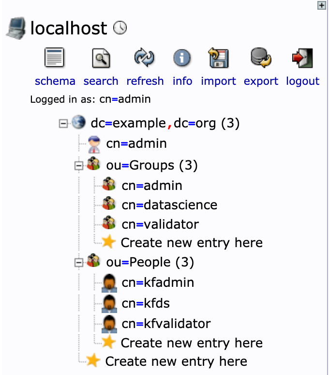
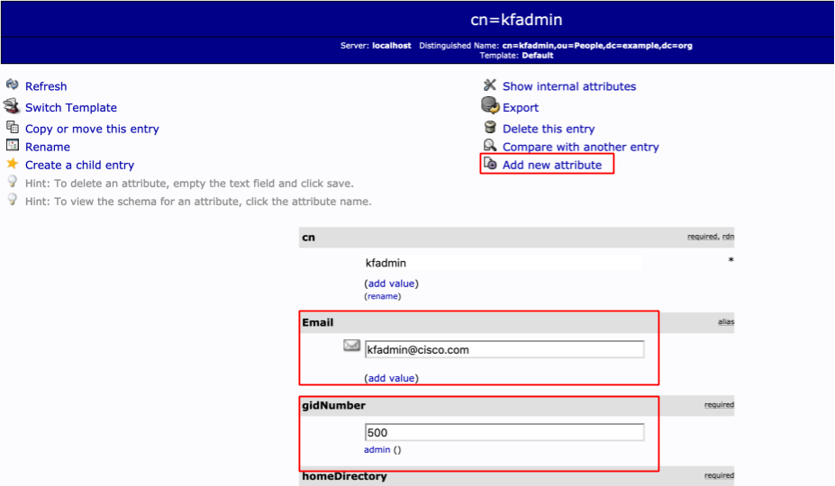

# Create Users and Groups in LDAP server

We are going to create three users and three groups:

| User | Group | Email |
| ---- | ----- | ----- |
| kfadmin | admin | kfadmin@example.com |
| kfds | datascience | kfds@example.com |
| kfvalidator | validator | kfvalidator@example.com |

Open LDAP Admin url: http://ldap-admin.example.com:32006.  

Login with your credentials:  

**Username**: cn=admin,dc=example,dc=org  
**Password**: admin  

***Note***: Username and password are a part of your LDAP service config in the kustomize package for installing authentication with LDAP.

Create two organisational units: People and Groups. These organisational units should be a child of *dc=example,dc=org* which results in *ou=People,dc=example,dc=org* and *ou=Groups,dc=example,dc=org*.

Within *ou=Groups,dc=example,dc=org*:
Create three posix groups:
* admin (cn=admin,ou=Groups,dc=example,dc=org)
* datascience (cn=datascience,ou=Groups,dc=example,dc=org)
* validator  (cn=validator,ou=Groups,dc=example,dc=org)

And within *ou=People,dc=example,dc=org*:
Create three generic user accounts:
* kfadmin (cn=kfadmin,ou=Groups,dc=example,dc=org)
* kfds (cn=kfds,ou=Groups,dc=example,dc=org)
* kfvalidator  (cn=kfvalidator,ou=Groups,dc=example,dc=org)

Now the LDAP tree on your screen’s left pane should appear like the following image:

While creating each user account, you need to ensure two additional steps:
Associate each user account with their respective groups as shown in the table above.
Click on add new attribute in the user’s information tab as shown highlighted in the figure below, and add an email attribute for each user as mentioned in the table. This email will be later used to log in through dex client application.

Your LDAP server is now setup with required users and groups.
