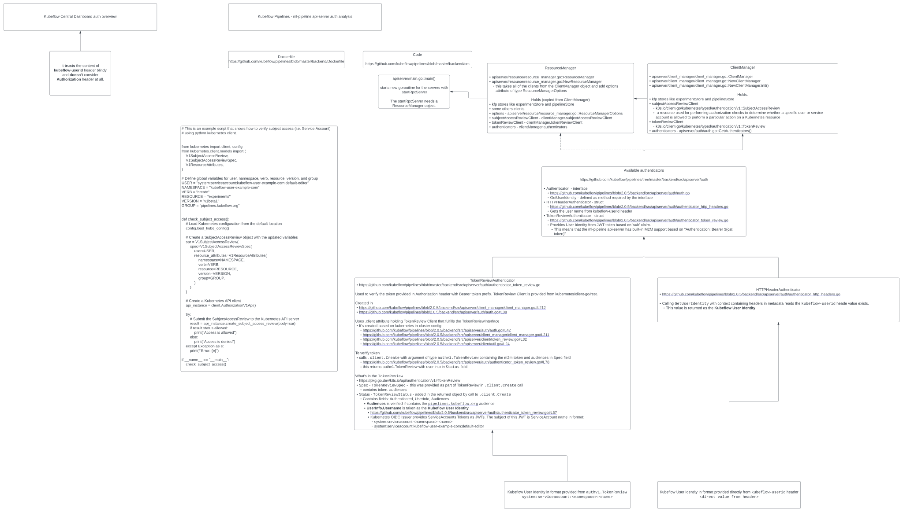
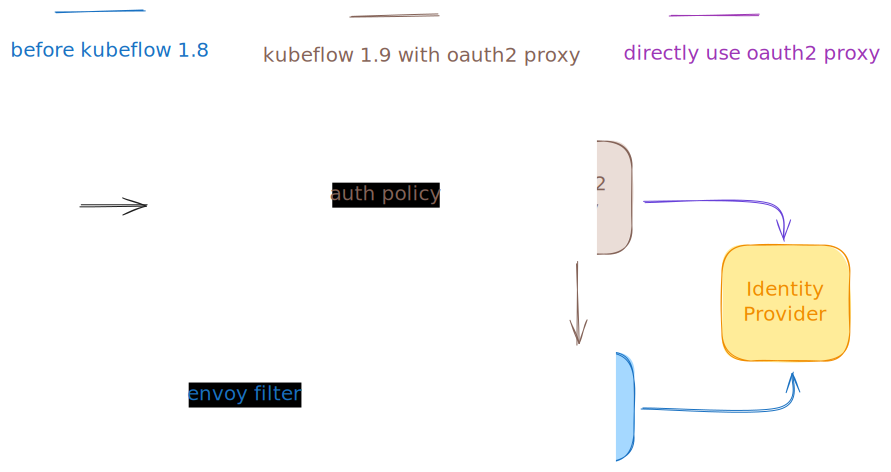

# Kubeflow Authentication using Oauth2 Proxy

## Istio envoyExtAuthzHttp

This is Istio's recommended approach for External Authorization[^2]. It is not limited to the use
of `oauth2-proxy`[^3] alone. This method is an industry standard, meeting all of Kubeflow's
current and foreseeable authentication needs.

## Kubeflow Pipelines User and M2M Authentication and Authorization

The Kubeflow Pipelines component relies on the built-in kubernetes functionalities to authenticate and authorize
user requests, specifically the TokenReviews[^4] and SubjectAccessReview[^5].

The best way to describe how it works is to explain with an example. Lets analyze the flow
when a client calls the API to list the KF Pipeline runs:

1. api-server starts endpoints in:

   https://github.com/kubeflow/pipelines/blob/2.0.5/backend/src/apiserver/main.go#L95

   Focusing on the pipelines run service:

   1. Register Run Service:
      * https://github.com/kubeflow/pipelines/blob/2.0.5/backend/src/apiserver/main.go#L116
   2. proto RPC definition of ListRunsV1
      * https://github.com/kubeflow/pipelines/blob/2.0.5/backend/api/v1beta1/run.proto#L80
   3. code definition of ListRunsV1
      * https://github.com/kubeflow/pipelines/blob/2.0.5/backend/src/apiserver/server/run_server.go#L226
   4. ListRunsV1 calls internal method `listRuns`
      * https://github.com/kubeflow/pipelines/blob/2.0.5/backend/src/apiserver/server/run_server.go#L188
   5. `listRuns` calls internal method `canAccessRun` which itself calls `s.resourceManager.IsAuthorized`
      * https://github.com/kubeflow/pipelines/blob/2.0.5/backend/src/apiserver/server/run_server.go#L637
   6. `ResourceManager.IsAuthorized` first tries to authenticate over every available authenticator, which are the `TokenReviewAuthenticator` and `HTTPHeaderAuthenticator`
      * here the user identity is either the user email provided directly in the `kubeflow-userid` header or the user identity obtained from provided token
      * https://github.com/kubeflow/pipelines/blob/master/backend/src/apiserver/resource/resource_manager.go#L1667
   7. `TokenReviewAuthenticator.GetUserIdentity` gets the token from `Authorization` header and calls the K8s Auth `authv1.TokenReview` with given token which in return provides `userInfo := review.Status.User`. `GetUserIdentity` return `userInfo.Username` which at this point is the `system:serviceaccount:default:default`.
      * https://github.com/kubeflow/pipelines/blob/2.0.5/backend/src/apiserver/auth/authenticator_token_review.go#L53
   8. Next in `ResourceManager.IsAuthorized` a SubjectAccessReview is created with `r.subjectAccessReviewClient.Create` with arguments specifying RBAC verbs provided in code definition of `RunServer.listRuns`. If the user (sa) is not authorized, an error is thrown
      * https://github.com/kubeflow/pipelines/blob/master/backend/src/apiserver/resource/resource_manager.go#L1703
      * if the identity was obtained from token (service account), the `rolebinding.rbac.authorization.k8s.io/default-editor` provides the RBAC permission
      * if the identity was obtained from header (user), the `rolebinding.rbac.authorization.k8s.io/user-example-com` or similar provides the RBAC permission
2. User calls api to list pipeline runs as unauthorized service account.

   * This can be done by running Pod with curl in `default` namespace:
     ```bash
     $ kubectl -n default run -ti --rm curl --image curlimages/curl --command -- sh
     # v1beta1
     ~ $ curl "istio-ingressgateway.istio-system/pipeline/apis/v1beta1/runs?resource_reference_key.type=NAMESPACE&resource_reference_key.id=kubeflow-user-example-com" -H "Authorization: Bearer $(cat /run/secrets/kubernetes.io/serviceaccount/token)"
     {"error":"Failed to list v1beta1 runs: Failed to list runs due to authorization error. Check if you have permission to access namespace kubeflow-user-example-com: Failed to access run . Check if you have access to namespace kubeflow-user-example-com: PermissionDenied: User 'system:serviceaccount:default:default' is not authorized with reason:  (request: \u0026ResourceAttributes{Namespace:kubeflow-user-example-com,Verb:list,Group:pipelines.kubeflow.org,Version:v1beta1,Resource:runs,Subresource:,Name:,}): Unauthorized access","code":7,"message":"Failed to list v1beta1 runs: Failed to list runs due to authorization error. Check if you have permission to access namespace kubeflow-user-example-com: Failed to access run . Check if you have access to namespace kubeflow-user-example-com: PermissionDenied: User 'system:serviceaccount:default:default' is not authorized with reason:  (request: \u0026ResourceAttributes{Namespace:kubeflow-user-example-com,Verb:list,Group:pipelines.kubeflow.org,Version:v1beta1,Resource:runs,Subresource:,Name:,}): Unauthorized access","details":[{"@type":"type.googleapis.com/google.rpc.Status","code":7,"message":"User 'system:serviceaccount:default:default' is not authorized with reason:  (request: \u0026ResourceAttributes{Namespace:kubeflow-user-example-com,Verb:list,Group:pipelines.kubeflow.org,Version:v1beta1,Resource:runs,Subresource:,Name:,})"}]}
     # v2beta1
     ~ $ curl istio-ingressgateway.istio-system/pipeline/apis/v2beta1/runs?namespace=kubeflow-user-example-com -H "Authorization: Bearer $(cat /run/secrets/kubernetes.io/serviceaccount/token)"
     {"error":"Failed to list runs: Failed to list runs due to authorization error. Check if you have permission to access namespace kubeflow-user-example-com: Failed to access run . Check if you have access to namespace kubeflow-user-example-com: PermissionDenied: User 'system:serviceaccount:default:default' is not authorized with reason:  (request: \u0026ResourceAttributes{Namespace:kubeflow-user-example-com,Verb:list,Group:pipelines.kubeflow.org,Version:v1beta1,Resource:runs,Subresource:,Name:,}): Unauthorized access","code":7,"message":"Failed to list runs: Failed to list runs due to authorization error. Check if you have permission to access namespace kubeflow-user-example-com: Failed to access run . Check if you have access to namespace kubeflow-user-example-com: PermissionDenied: User 'system:serviceaccount:default:default' is not authorized with reason:  (request: \u0026ResourceAttributes{Namespace:kubeflow-user-example-com,Verb:list,Group:pipelines.kubeflow.org,Version:v1beta1,Resource:runs,Subresource:,Name:,}): Unauthorized access","details":[{"@type":"type.googleapis.com/google.rpc.Status","code":7,"message":"User 'system:serviceaccount:default:default' is not authorized with reason:  (request: \u0026ResourceAttributes{Namespace:kubeflow-user-example-com,Verb:list,Group:pipelines.kubeflow.org,Version:v1beta1,Resource:runs,Subresource:,Name:,})"}]}
     ```
3. User calls api to list pipeline runs as authorized service account.

   * This can be done by running Pod with curl in `kubeflow-user-example-com` namespace specifying correct service account:
     ```bash
     $ kubectl -n kubeflow-user-example-com run -ti --rm curl --image curlimages/curl --command --overrides='{"spec": {"serviceAccountName": "default-editor"}}' -- sh
     # v1beta1
     ~ $ curl "istio-ingressgateway.istio-system/pipeline/apis/v1beta1/runs?resource_reference_key.type=NAMESPACE&resource_reference_key.id=kubeflow-user-example-com" -H "Authorization: Bearer $(cat /run/secrets/kubernetes.io/serviceaccount/token)"
     {}  # empty response which is fine because no pipeline runs exist
     # v2beta1
     ~ $ curl istio-ingressgateway.istio-system/pipeline/apis/v2beta1/runs?namespace=kubeflow-user-example-com -H "Authorization: Bearer $(cat /run/secrets/kubernetes.io/serviceaccount/token)"
     {}  # empty response which is fine because no pipeline runs exist
     ```

### Authentication and Authorization analysis diagram for Kubeflow Pipelines


### Change the default authentication from "Dex + Oauth2-proxy" to "Oauth2-proxy" only

The authentication in Kubeflow evolved over time and we dropped envoyfilters and oidc-authservice in favor of RequestAuthentication and Oauth2-proxy in Kubeflow 1.9.


You can adjust OAuth2 Proxy to directly connect to your own IDP(Identity Provider) suchg as GCP, [AWS](https://docs.aws.amazon.com/cognito/latest/developerguide/federation-endpoints-oauth-grants.html), Azure etc:

1. Create an application on your IdP (purple line)
2. Change your [OAuth2 Proxy issuer](https://github.com/kubeflow/manifests/blob/35539f162ea7fafc8c5035d8df0d8d8cf5a9d327/common/oauth2-proxy/base/oauth2-proxy-config.yaml#L10) to your IdP. Of course never ever directly, but with kustomize overlays and components.

Here is an example of patching oauth2-proxy to connect directly to Azure IDP and skip Dex.
This is enterprise integration so feel free to hire consultants or pay for commercial distributions if you need more help.
For example Azure returns rather large headers compared to other IDPs, so maybe you need to annotate the nginx-ingress to support that.

```
# based on https://github.com/kubeflow/manifests/blob/master/common/oauth2-proxy/base/oauth2_proxy.cfg
# and https://oauth2-proxy.github.io/oauth2-proxy/configuration/providers/azure/
apiVersion: v1
kind: ConfigMap
metadata:
  name: oauth2-proxy
  namespace: oauth2-proxy
data:
  oauth2_proxy.cfg: |
    provider = "oidc"
    oidc_issuer_url = "https://login.microsoftonline.com/$MY_TENANT/v2.0"
    scope = "openid email offline_access" # removed groups and profile to decrease the size and added offline_access to enable refresh tokens
    email_domains = [ "*" ]

    # serve a static HTTP 200 upstream on for authentication success
    # we are using oauth2-proxy as an ExtAuthz to "check" each request, not pass it on
    upstreams = [ "static://200" ]

    # skip authentication for these paths
    skip_auth_routes = [
      "^/dex/",
    ]

    # requests to paths matching these regex patterns will receive a 401 Unauthorized response
    # when not authenticated, instead of being redirected to the login page with a 302,
    # this prevents background requests being redirected to the login page,
    # and the accumulation of CSRF cookies
    api_routes = [
      # Generic
      # NOTE: included because most background requests contain these paths
      "/api/",
      "/apis/",

      # Kubeflow Pipelines
      # NOTE: included because KFP UI makes MANY background requests to these paths but because they are
      #       not `application/json` requests, oauth2-proxy will redirect them to the login page
      "^/ml_metadata",
    ]

    skip_provider_button = true
    set_authorization_header = true
    set_xauthrequest = true
    cookie_name = "oauth2_proxy_kubeflow"
    cookie_expire = "24h"
    cookie_refresh = "59m" # This improves the user experience a lot
    redirect_url = "https://$MY_PUBLIC_KUBEFLOW_DOMAIN/oauth2/callback"
    relative_redirect_url = false
```

3. In the istio-system namespace is a RequestAuthentication resource. You need to change its issuer to your own IdP, or even better create an additional one.

```
apiVersion: security.istio.io/v1beta1
kind: RequestAuthentication
metadata:
  name: azure-aad-requestauthentication
  namespace: istio-system
spec:
  # we only apply to the ingress-gateway because:
  #  - there is no need to verify the same tokens at each sidecar
  #  - having no selector will apply to the RequestAuthentication to ALL
  #    Pods in the mesh, even ones which are not part of Kubeflow
  selector:
    matchLabels:
      app: istio-ingressgateway

  jwtRules:
  - issuer: https://login.microsoftonline.com/$MY_TENANT/v2.0

    # `forwardOriginalToken` is not strictly required to be true.
    # there are pros and cons to each value:
    #  - true: the original token is forwarded to the destination service
    #          which raises the risk of the token leaking
    #  - false: the original token is stripped from the request
    #           which will prevent the destination service from
    #           verifying the token (possibly with its own RequestAuthentication)
    forwardOriginalToken: true

    # This will unpack the JWTs issued by Dex or other IDPs into the expected headers.
    # It is applied to BOTH the m2m tokens from outside the cluster (which skip
    # oauth2-proxy because they already have a dex JWT), AND user requests which were
    # authenticated by oauth2-proxy (which injected a dex JWT).
    outputClaimToHeaders:
    - header: kubeflow-userid
      claim: email
    - header: kubeflow-groups
      claim: groups

    # We explicitly set `fromHeaders` to ensure that the JWT is only extracted from the `Authorization` header.
    # This is because we exclude requests that have an `Authorization` header from oauth2-proxy.
    fromHeaders:
    - name: Authorization
      prefix: "Bearer "
```

You can also add more RequestAuthentication to support other issuers as for example for M2M access from github actions as explained in the root level Readme.md.
This feature is useful when you need to integrate Kubeflow with your current CI/CD platform (GitHub Actions, Jenkins) via machine-to-machine authentication.
The following is an example for obtaining and using a JWT token From your IDP with Python, but you can also just take a look at our CI/CD test that uses simple Kubernetes serviceaccount tokens to access KFP, Jupyterlabs etc. from GitHub Actions.

```
import requests
token_url = "https://your-idp.com/oauth/token"
client_id = "YOUR_CLIENT_ID"
client_secret = "YOUR_CLIENT_SECRET"
username = "YOUR_USERNAME"
password = "YOUR_PASSWORD"
# request header
headers = {
    "Content-Type": "application/x-www-form-urlencoded"
}
data = {
    "grant_type": "password",
    "client_id": client_id,
    "client_secret": client_secret,
    "username": username,
    "password": password,
    "scope": "openid profile email"  #change your scope
}
response = requests.post(token_url, headers=headers, data=data)
TOKEN = response.json()['access_token']
```

```
import kfp
kubeflow_host="https://your_host"
pipeline_host = kubeflow_host + "/pipeline" 
client = kfp.Client(host=pipeline_host, existing_token=TOKEN)
print(client.list_runs(namespace="your-profile-name"))
```

## Known Issues:

Some openidc providers such as Azure provide too large JWTs / Cookies that exceed the limit of most GRPC and gunicorn web application deployments in Kubeflow.
If removing the groups claim in oauth2-proxy is not enough then you can add an envrionment variable to all web applications

```
apiVersion: apps/v1
kind: Deployment
metadata:
  name: kserve-models-web-app
  namespace: kubeflow
spec:
  template:
    spec:
      containers:
        - name: kserve-models-web-app # repeat for all other *-web-app-(deployment)
          env:
            - name: GUNICORN_CMD_ARGS
              value: --limit-request-field_size 32000
```

and modify the KFP GRPC server via
```
- path: patches/metadata-grpc-virtualservice-patch.yaml
  target:
    kind: VirtualService
    name: metadata-grpc
    namespace: kubeflow

# patches/metadata-grpc-virtualservice-patch.yaml
# Remove the oauth2-proxy cookie that violates the maximum metadata size for a GRPC request
- op: add
  path: /spec/http/0/route/0/headers
  value:
    request:
      remove:
        - Cookie
```

to fix `received initial metadata size exceeds limit`.

## Kubeflow Notebooks User and M2M Authentication and Authorization

The underlying mechanism is the same as in Kubeflow Pipelines.

Similarly, to explain how it works, let's analyze the code step by step, starting from the api route definition
for listing notebooks:

* list notebooks api route definition
  * https://github.com/kubeflow/kubeflow/blob/v1.8.0/components/crud-web-apps/jupyter/backend/apps/common/routes/get.py#L53
  * this calls `crud_backend/api/notebook.py::list_notebooks`
* `crud_backend/api/notebook.py::list_notebooks` calls `authz.ensure_authorized`
  * https://github.com/kubeflow/kubeflow/blob/v1.8.0/components/crud-web-apps/common/backend/kubeflow/kubeflow/crud_backend/api/notebook.py#L24
* `crud_backend/authz.py::ensure_authorized` calls `crud_backend/authn.py::get_username`
  * https://github.com/kubeflow/kubeflow/blob/v1.8.0/components/crud-web-apps/common/backend/kubeflow/kubeflow/crud_backend/authz.py#L101
  * https://github.com/kubeflow/kubeflow/blob/v1.8.0/components/crud-web-apps/common/backend/kubeflow/kubeflow/crud_backend/authn.py#L12
  * `crud_backend/authn.py::get_username` gets the user id from userid header (email or sa in format `system:serviceaccount:kubeflowusernamespace:default-editor`)
* `crud_backend/authz.py::ensure_authorized` calls `crud_backend/authz.py::is_authorized`
  * https://github.com/kubeflow/kubeflow/blob/v1.8.0/components/crud-web-apps/common/backend/kubeflow/kubeflow/crud_backend/authz.py#L46
  * this calls `create_subject_access_review` which uses the same mechanism as pipelines with `r.subjectAccessReviewClient.Create`

## KServe Authentication

KServe inference endpoints are secured through a layered approach using
Istio `RequestAuthentication` and `AuthorizationPolicy` resources.
The examples below focus on machine-to-machine (M2M) access using service
account tokens. Browser-based user access follows the general Kubeflow
`oauth2-proxy` flow described above.

### Traffic Flow and Security Layers

Inference requests to KServe models pass through two security checkpoints:

```
client ──► istio-ingressgateway (istio-system) ──► predictor pod sidecar ──► predictor container
              │                                         │
              ▼                                         ▼
         RequestAuthentication                   AuthorizationPolicy
         (JWT validation)                        (access control)
```

1. **Ingress gateway** (`istio-system`): A `RequestAuthentication` resource
   validates the JWT in the `Authorization: Bearer <token>` header. Requests
   with an invalid token are rejected with `401`. Requests without any token
   pass through (handled by the `AuthorizationPolicy` at the next layer).
2. **Predictor pod sidecar**: An `AuthorizationPolicy` controls which
   requests reach the model container.

### Configuring AuthorizationPolicy for Predictor Pods

Kubeflow ships a `global-deny-all` `AuthorizationPolicy` in `istio-system` that
blocks all mesh traffic by default. To allow inference traffic to reach a
predictor pod, you must create an `AuthorizationPolicy` in the model's
namespace.

The **intended** configuration uses `requestPrincipals: ["*"]`, which matches
any request carrying a validated JWT principal:

```yaml
apiVersion: security.istio.io/v1beta1
kind: AuthorizationPolicy
metadata:
  name: allow-isvc-sklearn
  namespace: kubeflow-user-example-com
spec:
  action: ALLOW
  rules:
  - from:
    - source:
        requestPrincipals: ["*"]
  selector:
    matchLabels:
      serving.knative.dev/service: isvc-sklearn-predictor
```

`requestPrincipals: ["*"]` relies on the JWT principal being propagated from
the ingress gateway to the predictor pod's Envoy sidecar. This propagation
depends on the Istio mTLS and `PeerAuthentication` configuration of the
cluster. In environments where the principal is not propagated (e.g., some
KinD-based CI setups), `requestPrincipals` will always be empty at the
sidecar, and the rule will never match.

In such environments, the CI tests use a permissive fallback:

```yaml
spec:
  action: ALLOW
  rules:
  - {}   # allow-all: security is enforced at the ingress gateway
  selector:
    matchLabels:
      serving.knative.dev/service: isvc-sklearn-predictor
```

> **Important:** `rules: [{}]` allows **all** traffic to the predictor pod,
> including unauthenticated requests that bypass the ingress gateway.
> This is acceptable in CI because the ingress gateway's
> `RequestAuthentication` is the primary security boundary — it validates
> the JWT **before** forwarding traffic to the predictor. However, in
> production clusters with proper mTLS configuration, prefer
> `requestPrincipals: ["*"]` for defense in depth.

### Path-Based and Host-Based Routing

KServe supports two routing modes for inference requests, both secured by the
same authentication flow:

| Mode | URL pattern | Configuration |
|------|-------------|---------------|
| Path-based | `http://<gateway>/serving/<namespace>/<name>/v1/models/<name>:predict` | `pathTemplate` in `inferenceservice-config` ConfigMap |
| Host-based | `http://<gateway>/v1/models/<name>:predict` with `Host: <name>.<namespace>.example.com` | `domainTemplate` in `inferenceservice-config` ConfigMap |

Path-based routing is configured via a kustomize patch on the
`inferenceservice-config` ConfigMap
(`applications/kserve/kserve/kustomization.yaml`):

```json
{
  "pathTemplate": "/serving/{{ .Namespace }}/{{ .Name }}"
}
```

KServe auto-generates a `VirtualService` on the `kubeflow-gateway` for each
`InferenceService`, enabling both routing modes simultaneously.

### KServe Models Web Application Authentication

The KServe Models Web Application (`kserve-models-web-app`) uses the same
XSRF + Bearer token authentication pattern as other Kubeflow web applications.
API calls require:

1. A valid XSRF token (obtained via cookie on the initial page load)
2. A valid `Authorization: Bearer <token>` header
3. The token's identity must have RBAC permissions in the target namespace

Unauthorized service accounts (e.g., `default` SA from a different namespace)
receive `401`/`403` when attempting to list `InferenceService` resources in a
namespace they do not have access to.

### CI Test Coverage

The KServe test suite (`tests/kserve_test.sh`) validates the following
authentication and security scenarios end-to-end in a KinD cluster:

| # | Test | What is verified |
|---|------|-----------------|
| 1 | Model prediction via KServe Python SDK | InferenceService deployment, prediction, and cleanup using the `kserve` SDK with M2M token |
| 2a | Path-based routing without token | Unauthenticated request returns `403`/`302` |
| 2b | Host-based routing without token | Unauthenticated request returns `403`/`302` |
| 2c | Path-based routing with valid token | Authenticated request returns `200` |
| 2d | Host-based routing with valid token | Authenticated request returns `200` |
| 3 | KServe Models Web App API | XSRF + auth flow, unauthorized SA gets `401`/`403` |
| 4 | Knative Service auth via cluster-local-gateway | Unauthenticated and invalid-token requests are rejected |
| 5 | Cluster-local-gateway authentication | Direct access without token returns `403` |
| 6 | Namespace isolation | Cross-namespace attacker token is rejected |

### Architecture Analysis (Future Improvements)

The analysis of KServe auth capabilities suggests that while it's possible to limit access to only authenticated agents,
there might be some improvements required to enable access only to authorized agents.

This is based on the following:

1. KServe Controller Manager patch integrating kube-rbac-proxy[^6].

   This suggests the kserve **might** use the same mechanism based on
   `SubjectAccessReviews`. Having a look at the kubeflow/manifests I see it's
   not enabled.
2. Search through the docs and code:

   * https://github.com/kserve/kserve/tree/v0.12.0/docs/samples/istio-dex
   * https://github.com/kserve/kserve/tree/v0.12.0/docs/samples/gcp-iap

   The docs above mention that while it's possible to enable authentication,
   authorization is more complicated and probably we need to add
   `AuthorizationPolicy`

   > create an [Istio AuthorizationPolicy](https://istio.io/latest/docs/reference/config/security/authorization-policy/) to grant access to the pods or disable it

   Most probably some work is needed to enable authorized access to kserve models.
3. Potential improvement: adding `source.namespaces` to the `AuthorizationPolicy`
   to restrict access to traffic originating from specific namespaces (e.g.,
   `istio-system`). This would provide an additional layer of security but
   requires proper mTLS/PeerAuthentication configuration to propagate SPIFFE
   identities correctly.

## Links

[^1]: [Envoy Filter](https://istio.io/latest/docs/reference/config/networking/envoy-filter/)
[^2]: [External Authorization](https://istio.io/latest/docs/tasks/security/authorization/authz-custom/)
[^3]: [oauth2-proxy](https://github.com/oauth2-proxy/oauth2-proxy)
[^4]: [Kubernetes TokenReview](https://kubernetes.io/docs/reference/kubernetes-api/authentication-resources/token-review-v1/)
[^5]: [Kubernetes SubjectAccessReview](https://kubernetes.io/docs/reference/kubernetes-api/authorization-resources/subject-access-review-v3/)
[^6]: [Kube RBAC Proxy](https://github.com/brancz/kube-rbac-proxy)
