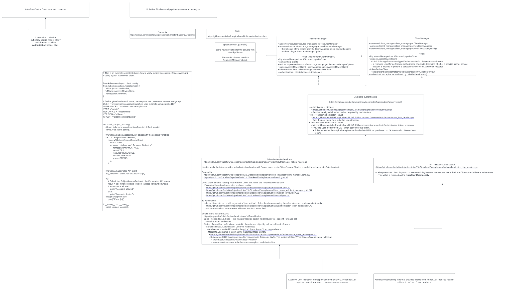

# Kubeflow Authentication using OIDC

## Istio Envoy Filter

> EnvoyFilter provides a mechanism to customize the Envoy configuration generated by Istio Pilot. Use EnvoyFilter to modify values for certain fields, add specific filters, or even add entirely new listeners, clusters, etc.[^1]

Kubeflow will use an Envoy Filter for every incoming request when is used
with `oidc-authservice`.

Usage of EnvoyFilter is currently not recommended. The preferred method for configuring External
Authentication in Istio is the `envoyExtAuthzHttp` extension provider[^2].

Envoy Filter is set up with [oidc-authservice](https://github.com/arrikto/oidc-authservice).

## Istio envoyExtAuthzHttp

This is Istio's recommended approach for External Authorization[^2]. It is not limited to the use
of `oauth2-proxy`[^3] alone. This method is an industry standard, meeting all of Kubeflow's
current and foreseeable authentication needs.

## Kubeflow Pipelines User and M2M Authentication and Authorization

Kubeflow Pipelines component relies on the built-in kubernetes functionalities to authenticate and authorize
user requests, specifically the TokenReviews[^4] and SubjectAccessReview[^5].

The best way to describe how it works is to explain with an example. Lets analyze the flow
when client calls API to list the KF Pipeline Runs:

1. api-server starts endpoints in:

   https://github.com/kubeflow/pipelines/blob/2.0.5/backend/src/apiserver/main.go#L95

   Focusing on the pipelines run service:

   1. Register Run Service:
      * https://github.com/kubeflow/pipelines/blob/2.0.5/backend/src/apiserver/main.go#L116
   2. proto RPC definition of ListRunsV1
      * https://github.com/kubeflow/pipelines/blob/2.0.5/backend/api/v1beta1/run.proto#L80
   3. code definition of ListRunsV1
      * https://github.com/kubeflow/pipelines/blob/2.0.5/backend/src/apiserver/server/run_server.go#L226
   4. ListRunsV1 calls internal method `listRuns`
      * https://github.com/kubeflow/pipelines/blob/2.0.5/backend/src/apiserver/server/run_server.go#L188
   5. `listRuns` calls internal method `canAccessRun` which itself calls `s.resourceManager.IsAuthorized`
      * https://github.com/kubeflow/pipelines/blob/2.0.5/backend/src/apiserver/server/run_server.go#L637
   6. `ResourceManager.IsAuthorized` first tries to authenticate over every available authenticator, which are the `TokenReviewAuthenticator` and `HTTPHeaderAuthenticator`
      * here the user identity is either the user email provided directly in the `kubeflow-userid` header or the user identity obtained from provided token
      * https://github.com/kubeflow/pipelines/blob/master/backend/src/apiserver/resource/resource_manager.go#L1667
   7. `TokenReviewAuthenticator.GetUserIdentity` gets the token from `Authorization` header and calls the K8s Auth `authv1.TokenReview` with given token which in return provides `userInfo := review.Status.User`. `GetUserIdentity` return `userInfo.Username` which at this point is the `system:serviceaccount:default:default`.
      * https://github.com/kubeflow/pipelines/blob/2.0.5/backend/src/apiserver/auth/authenticator_token_review.go#L53
   8. Next in `ResourceManager.IsAuthorized` a SubjectAccessReview is created with `r.subjectAccessReviewClient.Create` with arguments specifying RBAC verbs provided in code definition of `RunServer.listRuns`. If the user (sa) is not authorized, an error is thrown
      * https://github.com/kubeflow/pipelines/blob/master/backend/src/apiserver/resource/resource_manager.go#L1703
      * if the identity was obtained from token (service account), the `rolebinding.rbac.authorization.k8s.io/default-editor` provides the RBAC permission
      * if the identity was obtained from header (user), the `rolebinding.rbac.authorization.k8s.io/user-example-com` or similar provides the RBAC permission
2. User calls api to list pipeline runs as unauthorized service account.

   * This can be done by running Pod with curl in `default` namespace:
     ```bash
     $ kubectl -n default run -ti --rm curl --image curlimages/curl --command -- sh
     # v1beta1
     ~ $ curl "istio-ingressgateway.istio-system/pipeline/apis/v1beta1/runs?resource_reference_key.type=NAMESPACE&resource_reference_key.id=kubeflow-user-example-com" -H "Authorization: Bearer $(cat /run/secrets/kubernetes.io/serviceaccount/token)"
     {"error":"Failed to list v1beta1 runs: Failed to list runs due to authorization error. Check if you have permission to access namespace kubeflow-user-example-com: Failed to access run . Check if you have access to namespace kubeflow-user-example-com: PermissionDenied: User 'system:serviceaccount:default:default' is not authorized with reason:  (request: \u0026ResourceAttributes{Namespace:kubeflow-user-example-com,Verb:list,Group:pipelines.kubeflow.org,Version:v1beta1,Resource:runs,Subresource:,Name:,}): Unauthorized access","code":7,"message":"Failed to list v1beta1 runs: Failed to list runs due to authorization error. Check if you have permission to access namespace kubeflow-user-example-com: Failed to access run . Check if you have access to namespace kubeflow-user-example-com: PermissionDenied: User 'system:serviceaccount:default:default' is not authorized with reason:  (request: \u0026ResourceAttributes{Namespace:kubeflow-user-example-com,Verb:list,Group:pipelines.kubeflow.org,Version:v1beta1,Resource:runs,Subresource:,Name:,}): Unauthorized access","details":[{"@type":"type.googleapis.com/google.rpc.Status","code":7,"message":"User 'system:serviceaccount:default:default' is not authorized with reason:  (request: \u0026ResourceAttributes{Namespace:kubeflow-user-example-com,Verb:list,Group:pipelines.kubeflow.org,Version:v1beta1,Resource:runs,Subresource:,Name:,})"}]}
     # v2beta1
     ~ $ curl istio-ingressgateway.istio-system/pipeline/apis/v2beta1/runs?namespace=kubeflow-user-example-com -H "Authorization: Bearer $(cat /run/secrets/kubernetes.io/serviceaccount/token)"
     {"error":"Failed to list runs: Failed to list runs due to authorization error. Check if you have permission to access namespace kubeflow-user-example-com: Failed to access run . Check if you have access to namespace kubeflow-user-example-com: PermissionDenied: User 'system:serviceaccount:default:default' is not authorized with reason:  (request: \u0026ResourceAttributes{Namespace:kubeflow-user-example-com,Verb:list,Group:pipelines.kubeflow.org,Version:v1beta1,Resource:runs,Subresource:,Name:,}): Unauthorized access","code":7,"message":"Failed to list runs: Failed to list runs due to authorization error. Check if you have permission to access namespace kubeflow-user-example-com: Failed to access run . Check if you have access to namespace kubeflow-user-example-com: PermissionDenied: User 'system:serviceaccount:default:default' is not authorized with reason:  (request: \u0026ResourceAttributes{Namespace:kubeflow-user-example-com,Verb:list,Group:pipelines.kubeflow.org,Version:v1beta1,Resource:runs,Subresource:,Name:,}): Unauthorized access","details":[{"@type":"type.googleapis.com/google.rpc.Status","code":7,"message":"User 'system:serviceaccount:default:default' is not authorized with reason:  (request: \u0026ResourceAttributes{Namespace:kubeflow-user-example-com,Verb:list,Group:pipelines.kubeflow.org,Version:v1beta1,Resource:runs,Subresource:,Name:,})"}]}
     ```
3. User calls api to list pipeline runs as authorized service account.

   * This can be done by running Pod with curl in `kubeflow-user-example-com` namespace specifying correct service account:
     ```bash
     $ kubectl -n kubeflow-user-example-com run -ti --rm curl --image curlimages/curl --command --overrides='{"spec": {"serviceAccountName": "default-editor"}}' -- sh
     # v1beta1
     ~ $ curl "istio-ingressgateway.istio-system/pipeline/apis/v1beta1/runs?resource_reference_key.type=NAMESPACE&resource_reference_key.id=kubeflow-user-example-com" -H "Authorization: Bearer $(cat /run/secrets/kubernetes.io/serviceaccount/token)"
     {}  # empty response which is fine because no pipeline runs exist
     # v2beta1
     ~ $ curl istio-ingressgateway.istio-system/pipeline/apis/v2beta1/runs?namespace=kubeflow-user-example-com -H "Authorization: Bearer $(cat /run/secrets/kubernetes.io/serviceaccount/token)"
     {}  # empty response which is fine because no pipeline runs exist
     ```

### Auth analysis diagram for Kubeflow Pipelines



## Kubeflow Notebooks User and M2M Authentication and Authorization

The underlying mechanism is the same as in Kubeflow Pipelines.

Similarly, to explain how it works, let's analyze the code step by step, starting from the api route definition
for listing notebooks:

* list notebooks api route definition
  * https://github.com/kubeflow/kubeflow/blob/v1.8.0/components/crud-web-apps/jupyter/backend/apps/common/routes/get.py#L53
  * this calls `crud_backend/api/notebook.py::list_notebooks`
* `crud_backend/api/notebook.py::list_notebooks` calls `authz.ensure_authorized`
  * https://github.com/kubeflow/kubeflow/blob/v1.8.0/components/crud-web-apps/common/backend/kubeflow/kubeflow/crud_backend/api/notebook.py#L24
* `crud_backend/authz.py::ensure_authorized` calls `crud_backend/authn.py::get_username`
  * https://github.com/kubeflow/kubeflow/blob/v1.8.0/components/crud-web-apps/common/backend/kubeflow/kubeflow/crud_backend/authz.py#L101
  * https://github.com/kubeflow/kubeflow/blob/v1.8.0/components/crud-web-apps/common/backend/kubeflow/kubeflow/crud_backend/authn.py#L12
  * `crud_backend/authn.py::get_username` gets the user id from userid header (email or sa in format `system:serviceaccount:kubeflowusernamespace:default-editor`)
* `crud_backend/authz.py::ensure_authorized` calls `crud_backend/authz.py::is_authorized`
  * https://github.com/kubeflow/kubeflow/blob/v1.8.0/components/crud-web-apps/common/backend/kubeflow/kubeflow/crud_backend/authz.py#L46
  * this calls `create_subject_access_review` which uses the same mechanism as pipelines with `r.subjectAccessReviewClient.Create`

## KServe Authentication

The analysis of KServe auth capabilities suggests that while it's possible to limit access to only authenticated agents,
there might be some improvements required to enable access only to authorized agents.

This is based on the following:

1. KServe Controller Manager patch integrating kube-rbac-proxy[^6].

   This suggests the kserve **might** use the same mechanism based on
   `SubjectAccessReviews`. Having a look at the kubeflow/manifests I see it's
   not enabled.
2. Search through the docs and code:

   * https://github.com/kserve/kserve/tree/v0.12.0/docs/samples/istio-dex
   * https://github.com/kserve/kserve/tree/v0.12.0/docs/samples/gcp-iap

   The docs above mention that while it's possible to enable authentication,
   authorization is more complicated and probably we need to add
   `AuthorizationPolicy`...

   > create an [Istio AuthorizationPolicy](https://istio.io/latest/docs/reference/config/security/authorization-policy/) to grant access to the pods or disable it

   Most probably some work is needed to enable authorized access to kserve models.

## Links

[^1]: [Envoy Filter](https://istio.io/latest/docs/reference/config/networking/envoy-filter/)
[^2]: [External Authorization](https://istio.io/latest/docs/tasks/security/authorization/authz-custom/)
[^3]: [oauth2-proxy](https://github.com/oauth2-proxy/oauth2-proxy)
[^4]: [Kubernetes TokenReview](https://kubernetes.io/docs/reference/kubernetes-api/authentication-resources/token-review-v1/)
[^5]: [Kubernetes SubjectAccessReview](https://kubernetes.io/docs/reference/kubernetes-api/authorization-resources/subject-access-review-v3/)
[^6]: [Kube RBAC Proxy](https://github.com/brancz/kube-rbac-proxy)
