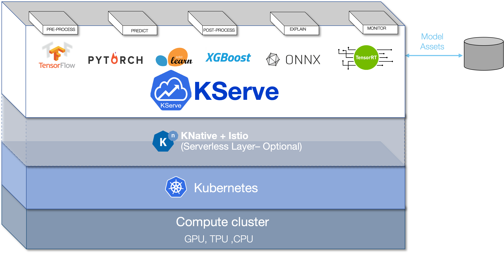

# KServe
[](https://goreportcard.com/report/github.com/kserve/kserve)
[](https://bestpractices.coreinfrastructure.org/projects/6643)
[](https://github.com/kserve/kserve/releases)
[](https://github.com/kserve/kserve/blob/master/LICENSE)

KServe provides a Kubernetes [Custom Resource Definition](https://kubernetes.io/docs/concepts/extend-kubernetes/api-extension/custom-resources/) for serving machine learning (ML) models on arbitrary frameworks. It aims to solve production model serving use cases by providing performant, high abstraction interfaces for common ML frameworks like Tensorflow, XGBoost, ScikitLearn, PyTorch, and ONNX.

It encapsulates the complexity of autoscaling, networking, health checking, and server configuration to bring cutting edge serving features like GPU Autoscaling, Scale to Zero, and Canary Rollouts to your ML deployments. It enables a simple, pluggable, and complete story for Production ML Serving including prediction, pre-processing, post-processing and explainability. KServe is being [used across various organizations.](https://kserve.github.io/website/master/community/adopters/)

For more details, visit the [KServe website](https://kserve.github.io/website/).



_Since 0.7 [KFServing is rebranded to KServe](https://blog.kubeflow.org/release/official/2021/09/27/kfserving-transition.html), we still support the RTS release
[0.6.x](https://github.com/kserve/kserve/tree/release-0.6), please refer to corresponding release branch for docs_.

## Why KServe?
- KServe is a standard, cloud agnostic **Model Inference Platform** on Kubernetes, built for highly scalable use cases.
- Provides performant, **standardized inference protocol** across ML frameworks.
- Support modern **serverless inference workload** with **request based autoscaling including scale-to-zero** on **CPU and GPU**.
- Provides **high scalability, density packing and intelligent routing** using **ModelMesh**.
- **Simple and pluggable production serving** for **inference**, **pre/post processing**, **monitoring** and **explainability**.
- Advanced deployments for **canary rollout**, **pipeline**, **ensembles** with **InferenceGraph**.


## :hammer_and_wrench: Installation

### Standalone Installation
- **[Serverless Installation](https://kserve.github.io/website/master/admin/serverless/serverless/)**: KServe by default installs Knative for **serverless deployment** for InferenceService.
- **[Raw Deployment Installation](https://kserve.github.io/website/master/admin/kubernetes_deployment)**: Compared to Serverless Installation, this is a more **lightweight** installation. However, this option does not support canary deployment and request based autoscaling with scale-to-zero.
- **[ModelMesh Installation](https://kserve.github.io/website/master/admin/modelmesh/)**: You can optionally install ModelMesh to enable **high-scale**, **high-density** and **frequently-changing model serving** use cases.
- **[Quick Installation](https://kserve.github.io/website/master/get_started/)**: Install KServe on your local machine.

### Kubeflow Installation
KServe is an important addon component of Kubeflow, please learn more from the [Kubeflow KServe documentation](https://www.kubeflow.org/docs/external-add-ons/kserve/kserve) and follow [KServe with Kubeflow on AWS](https://awslabs.github.io/kubeflow-manifests/main/docs/component-guides/kserve) to learn how to use KServe on AWS.

## :hammer_and_pick: Models Web App
The Models web app is responsible for allowing the user to manipulate the Model Servers in their Kubeflow cluster. To achieve this it provides a user friendly way to handle the lifecycle of InferenceService CRs.
Please follow the [Kserve Models UI documentation](https://www.kubeflow.org/docs/external-add-ons/kserve/webapp/) for more information.

##  :rocket: Upgrading
For upgrading see [UPGRADE.md](UPGRADE.md)

## :microscope: Testing
### Testing Kserve
#### Prerequisite

1. Install Python >= 3.7
2. Install requirements
   ```sh
   pip install -r tests/requirements.txt
   ```
3. Create kubeflow namespace
   ```sh
   kubectl apply -k ../../common/kubeflow-namespace/base
   ```
4. Install cert manager
   ```sh
   kubectl apply -k ../../common/cert-manager/cert-manager/base
   kubectl apply -k ../../common/cert-manager/kubeflow-issuer/base
   ```
5. Install Istio
   ```sh
   kubectl apply -k ../../common/istio-1-16/istio-crds/base
   kubectl apply -k ../../common/istio-1-16/istio-namespace/base
   kubectl apply -k ../../common/istio-1-16/istio-install/base
   ```
6. Install knative
   ```sh
   kubectl apply -k ../../common/knative/knative-serving/overlays/gateways
   kubectl apply -k ../../common/istio-1-16/cluster-local-gateway/base
   kubectl apply -k ../../common/istio-1-16/kubeflow-istio-resources/base
   ```
7. Install kserve
   ```sh
   make install-kserve
   ```
> **_NOTE:_** If resource/crd installation fails please re-run the commands.

#### Steps
1. Create test namespace
   ```sh
   kubectl create ns kserve-test 
   ```
2. Configure domain name
   ```sh
   kubectl patch cm config-domain --patch '{"data":{"example.com":""}}' -n knative-serving
   ```

3. Port forward
   ```sh
   # start a new terminal and run
   INGRESS_GATEWAY_SERVICE=$(kubectl get svc --namespace istio-system --selector="app=istio-ingressgateway" --output jsonpath='{.items[0].metadata.name}')
   kubectl port-forward --namespace istio-system svc/${INGRESS_GATEWAY_SERVICE} 8080:80
   ```
4. Run test
   ```sh
   export KSERVE_INGRESS_HOST_PORT='localhost:8080'
   make test-kserve

### Testing Models WebApp
#### Prerequisite
1. Running kubernetes cluster
2. `kubectl` configured to talk to the desired cluster.

#### Steps
1. Run the test
   ```sh
   make test-models-webapp
   ```
## :flight_departure: [Create your first InferenceService](https://kserve.github.io/website/master/get_started/first_isvc)

## :blue_book: [InferenceService API Reference](https://kserve.github.io/website/master/reference/api/)

## :handshake: [Adopters](https://kserve.github.io/website/master/community/adopters/)

## :books: Learn More
To learn more about KServe, how to use various supported features, and how to participate in the KServe community,
please follow the [KServe website documentation](https://kserve.github.io/website).
Additionally, we have compiled a list of [presentations and demos](https://kserve.github.io/website/master/community/presentations/) to dive through various details.
