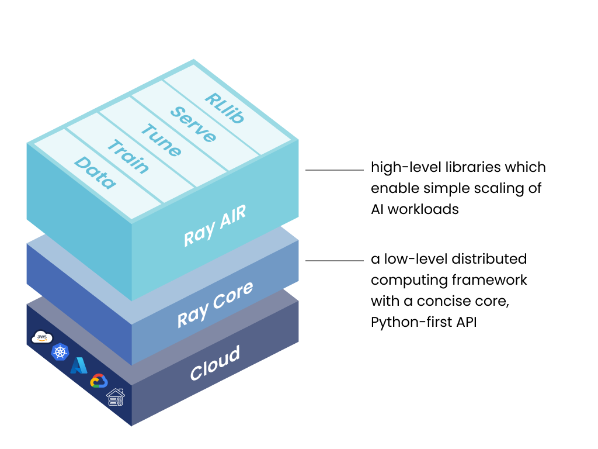
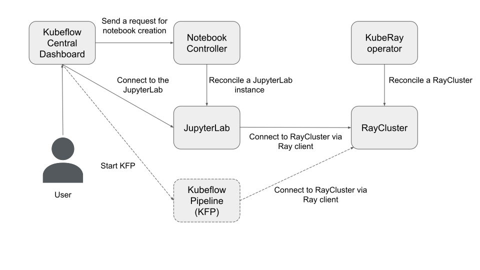

> Credit: This manifest refers a lot to the engineering blog ["Building a Machine Learning Platform with Kubeflow and Ray on Google Kubernetes Engine"](https://cloud.google.com/blog/products/ai-machine-learning/build-a-ml-platform-with-kubeflow-and-ray-on-gke) from Google Cloud.

# Ray
[Ray](https://github.com/ray-project/ray) is a unified framework for scaling AI and Python applications. Ray consists of a core distributed runtime and a toolkit of libraries (Ray AIR) for simplifying ML compute.

<figure>
  
  <figcaption>Stack of Ray libraries - unified toolkit for ML workloads. (ref: https://docs.ray.io/en/latest/ray-overview/index.html)</figcaption>
</figure>

# KubeRay
[KubeRay](https://github.com/ray-project/kuberay) is an open-source Kubernetes operator for Ray. It provides several CRDs to simplify managing Ray clusters on Kubernetes. We will integrate Kubeflow and KubeRay in this document.

# Requirements
* Dependencies
    * `kustomize`: v3.2.0 (Kubeflow manifest is sensitive to `kustomize` version.)
    * `Kubernetes`: v1.23

* Computing resources:
    * 16GB RAM
    * 8 CPUs

# Example
<figure>
  
  <figcaption>Note: (1) Kubeflow Central Dashboard will be renamed to workbench in the future. (2) Kubeflow Pipeline (KFP) is an important component of Kubeflow, but it is not included in this example.</figcaption>
</figure>

## Step 1: Install Kubeflow v1.6-branch
* This example installs Kubeflow with the [v1.6-branch](https://github.com/kubeflow/manifests/tree/v1.6-branch).

* Install all Kubeflow official components and all common services using [one command](https://github.com/kubeflow/manifests/tree/v1.6-branch#install-with-a-single-command).
    * If you do not want to install all components, you can comment out **KNative**, **Katib**, **Tensorboards Controller**, **Tensorboard Web App**, **Training Operator**, and **KServe** from [example/kustomization.yaml](https://github.com/kubeflow/manifests/blob/v1.6-branch/example/kustomization.yaml).

## Step 2: Install KubeRay operator
```sh
# Install a KubeRay operator and custom resource definitions.
kustomize build kuberay-operator/base | kubectl apply --server-side -f -

# Check KubeRay operator
kubectl get pod -l app.kubernetes.io/component=kuberay-operator
# NAME                                READY   STATUS    RESTARTS   AGE
# kuberay-operator-5b8cd69758-rkpvh   1/1     Running   0          6m23s
```

## Step 3: Install RayCluster
```sh
# Create a RayCluster CR, and the KubeRay operator will reconcile a Ray cluster
# with 1 head Pod and 1 worker Pod.
kubectl apply -f raycluster_example.yaml

# Check RayCluster
kubectl get pod -l ray.io/cluster=kubeflow-raycluster
# NAME                                           READY   STATUS    RESTARTS   AGE
# kubeflow-raycluster-head-p6dpk                 1/1     Running   0          70s
# kubeflow-raycluster-worker-small-group-l7j6c   1/1     Running   0          70s
```
* `raycluster_example.yaml` uses `rayproject/ray:2.2.0-py38-cpu` as its OCI image. Ray is very sensitive to the Python versions and Ray versions between the server (RayCluster) and client (JupyterLab) sides. This image uses:
    * Python 3.8.13
    * Ray 2.2.0

## Step 4: Forward the port of Istio's Ingress-Gateway
* Follow the [instructions](https://github.com/kubeflow/manifests/tree/v1.6-branch#port-forward) to forward the port of Istio's Ingress-Gateway and log in to Kubeflow Central Dashboard.

## Step 5: Create a JupyterLab via Kubeflow Central Dashboard
* Click "Notebooks" icon in the left panel.
* Click "New Notebook"
* Select `kubeflownotebookswg/jupyter-scipy:v1.6.1` as OCI image.
* Click "Launch"
* Click "CONNECT" to connect into the JupyterLab instance.

## Step 6: Use Ray client in the JupyterLab to connect to the RayCluster
* As I mentioned in Step 3, Ray is very sensitive to the Python versions and Ray versions between the server (RayCluster) and client (JupyterLab) sides.
    ```sh
    # Check Python version. The version's MAJOR and MINOR should match with RayCluster (i.e. Python 3.8)
    python --version 
    # Python 3.8.10
    
    # Install Ray 2.2.0
    pip install -U ray[default]==2.2.0
    ```
* Connect to RayCluster via Ray client.
    ```python
    # Open a new .ipynb page.

    import ray
    # ray://${RAYCLUSTER_HEAD_SVC}.${NAMESPACE}.svc.cluster.local:${RAY_CLIENT_PORT}
    ray.init(address="ray://kubeflow-raycluster-head-svc.default.svc.cluster.local:10001")
    print(ray.cluster_resources())
    # {'node:10.244.0.41': 1.0, 'memory': 3000000000.0, 'node:10.244.0.40': 1.0, 'object_store_memory': 805386239.0, 'CPU': 2.0}

    # Try Ray task
    @ray.remote
    def f(x):
        return x * x

    futures = [f.remote(i) for i in range(4)]
    print(ray.get(futures)) # [0, 1, 4, 9]

    # Try Ray actor
    @ray.remote
    class Counter(object):
        def __init__(self):
            self.n = 0

        def increment(self):
            self.n += 1

        def read(self):
            return self.n

    counters = [Counter.remote() for i in range(4)]
    [c.increment.remote() for c in counters]
    futures = [c.read.remote() for c in counters]
    print(ray.get(futures)) # [1, 1, 1, 1]
    ```

# Upgrading
See [UPGRADE.md](UPGRADE.md) for more details.
